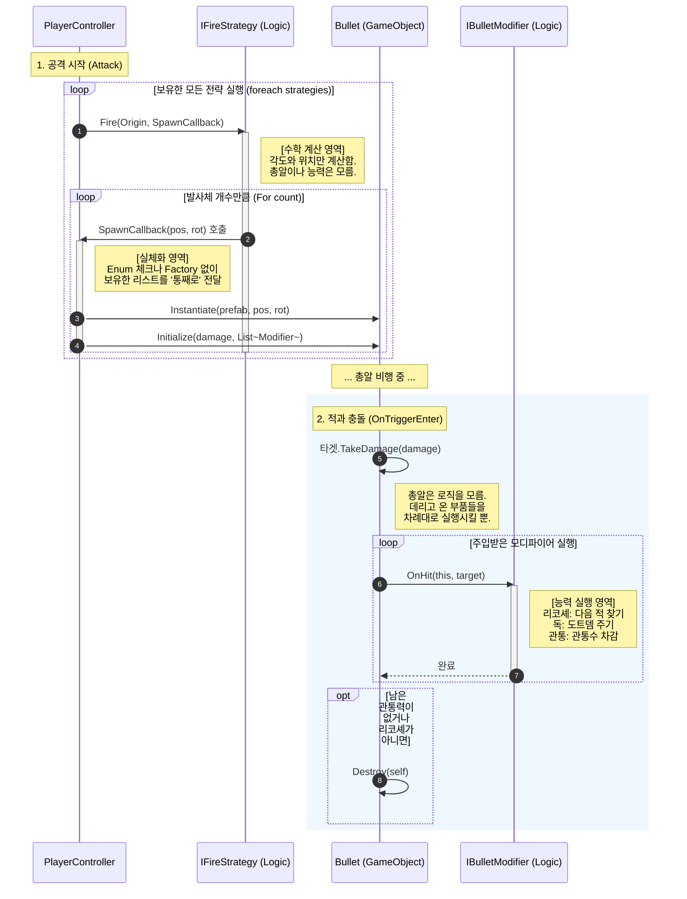

## 이 문서는 **전략 패턴(Strategy)**, **데이터 기반 설계(SO)**, 그리고 **콜백(Callback) 패턴**을 결합하여, 유연하고 재사용 가능한 구조를 만드는 데 초점을 맞췄습니다.

---

# 🏹 Archero-Like Combat System Architecture

## 0. 폴더 구조 (Project Hierarchy)

코드의 역할에 따라 폴더를 명확히 분리합니다.

```
Assets/
├── Scripts/
│   ├── Core/                        # [인터페이스/공통] 모든 시스템의 뼈대
│   │   ├── IFireStrategy.cs         # 발사 로직 인터페이스 (Fire)
│   │   ├── IBulletModifier.cs       # 총알 효과 인터페이스 (OnHit)
│   │   ├── IDamageable.cs           # 피격 인터페이스 (TakeDamage)
│   │   └── GameStats.cs             # 스탯 데이터 클래스
│   │
│   ├── Combat/                      # [전투 로직] 실제 계산을 수행하는 클래스들 (순수 C# 권장)
│   │   ├── Projectiles/
│   │   │   └── Bullet.cs            # Modifiers를 싣고 날아가는 운반체
│   │   ├── Strategies/              # 발사 패턴 구현체 (계산기)
│   │   │   ├── FanFireStrategy.cs
│   │   │   └── CircleFireStrategy.cs
│   │   └── Modifiers/               # 총알 능력 구현체 (행동대장)
│   │       ├── RicochetModifier.cs
│   │       ├── PoisonModifier.cs
│   │       └── PierceModifier.cs
│   │
│   ├── Characters/                  # [주체] 로직을 소유하고 사용하는 오브젝트
│   │   ├── Player/
│   │   │   └── PlayerController.cs  # 전략 리스트와 능력 리스트를 관리
│   │   └── Enemy/
│   │       └── EnemyController.cs   # SO에서 전략 하나를 받아와서 사용
│   │
│   ├── Systems/                     # [시스템] 게임 매니저
│   │   └── LevelUpManager.cs        # 스킬 뽑기 및 적용 UI 관리
│   │
│   └── ScriptableObjects/           # [데이터/팩토리] 로직 생성을 담당
│       ├── Base/
│       │   ├── SkillData.cs         # (Abstract) 모든 스킬의 부모
│       │   └── AttackPatternSO.cs   # (Abstract) 적 패턴의 부모
│       ├── Skills/                  # 플레이어용 스킬 데이터 (Apply 함수 구현)
│       │   ├── StatSkillData.cs
│       │   ├── PatternSkillData.cs
│       │   └── Modifiers/           # 능력별 개별 클래스 (중요!)
│       │       ├── RicochetSkillData.cs
│       │       └── PoisonSkillData.cs
│       └── Patterns/                # 몬스터 전용 적용 패턴 데이터 (CreateStrategy 구현)
│           └── FanPatternSO.cs
│
└── Resources/                       # [에셋] 실제 인스펙터에서 설정된 파일들
    └── Skills/
        ├── Ricochet_Lv1.asset
        ├── MultiShot.asset
        └── AttackBoost.asset
```

## 1. 아키텍처 개요 (Overview)

이 시스템의 핵심 철학은 **"역할의 완벽한 분리"**입니다.

- *기하학적 계산(Strategy)**은 총알의 생성 로직(Ability)을 모릅니다.
- **플레이어**는 전략을 여러 개 조합(List)하여 사용합니다.
- *적(Enemy)**은 데이터(SO)를 통해 하나의 전략을 설정하여 사용합니다.
- *총알(Bullet)**은 생성된 후 자신에게 부여된 능력(Ability)에 따라 독자적으로 행동합니다.

---

## 2. 전체 구조 다이어그램 (Class Diagram)

### 2-1. 클래스 다이어그램 해설 (Class Diagram Explanation)

이 다이어그램은 **데이터(SO)**, **로직(C# Class)**, **주체(Controller)**가 어떻게 역할을 나누고 협력하는지 보여줍니다.

### 1. Scripts_Core & Scripts_Combat (전투의 핵심 엔진)

- **역할:** 유니티 인스펙터나 데이터에 의존하지 않는 **순수 전투 로직**들이 모여 있는 곳입니다.
- **`IFireStrategy` (발사 전략 인터페이스):** "발사한다"는 행동의 규약입니다.
    - 구체적으로 '부채꼴로 쏠지', '원형으로 쏠지'는 `FanFireStrategy` 같은 구현체 클래스가 담당합니다.
- **`IBulletModifier` (총알 능력 인터페이스):** "맞았을 때의 효과"에 대한 규약입니다.
    - '튕길지', '독을 걸지'는 `RicochetModifier` 같은 구현체 클래스가 담당합니다.

### 2. Scripts_ScriptableObjects (데이터와 공장)

- **역할:** 기획자가 밸런스를 조절하는 **설계도**이자, 게임 실행 시 로직 객체를 찍어내는 **공장(Factory)**입니다.
- **`SkillData` (스킬 데이터):** * `PatternSkillData`: `FanFireStrategy` 같은 **전략 객체(계산기)**를 생성(`new`)하여 플레이어에게 전달합니다.
    - `ModifierSkillData`: `RicochetModifier` 같은 **능력 객체(부품)**를 생성(`new`)하여 플레이어에게 전달합니다.
- **핵심:** 이 SO들은 플레이어의 리스트(`strategies`, `modifiers`)에 새로운 로직을 **주입(Inject)** 해주는 배달부 역할을 합니다.

### 3. Scripts_Characters (조립 및 실행)

- **`PlayerController`:** 구체적인 로직(부채꼴, 리코셰 등)을 직접 알지 못합니다.
    - 오직 `List<IFireStrategy>`(발사 방식 목록)와 `List<IBulletModifier>`(능력 목록)라는 **부품 상자**만 가지고 있습니다.
    - 스킬을 획득할 때마다 이 상자에 새로운 부품이 추가됩니다.
- **`EnemyController`:** 플레이어와 달리 복잡한 스킬 조합이 없으므로, `AttackPatternSO`를 통해 **하나의 전략**만 생성해서 단순하게 사용합니다.

```mermaid
classDiagram
    %% =========================================================
    %% 1. Scripts/Core (인터페이스 및 공통 데이터)
    %% =========================================================
    namespace Scripts_Core {
        class IFireStrategy {
            <<Interface>>
            +Fire(Transform origin, Action~Vector3, Quaternion~ callback)
        }
        
        class IBulletModifier {
            <<Interface>>
            +OnHit(Bullet bullet, IDamageable target)
        }

        class IDamageable {
            <<Interface>>
            +TakeDamage(float amount)
            +Die()
        }

        class GameStats {
            +float damage
            +float attackSpeed
            +float hp
        }
    }

    %% =========================================================
    %% 2. Scripts/Combat (전투 로직 실체)
    %% =========================================================
    namespace Scripts_Combat {
        %% 2-1. Projectiles
        class Bullet {
            -float damage
            -List~IBulletModifier~ modifiers
            +Initialize(float dmg, List~IBulletModifier~ mods)
            -OnTriggerEnter(Collider other)
        }

        %% 2-2. Strategies (Implementations)
        class FanFireStrategy {
            -int count
            -float angle
            +Fire(origin, callback)
        }
        
        %% 2-3. Modifiers (Implementations)
        class RicochetModifier {
            +OnHit(bullet, target)
        }
        class PoisonModifier {
            +float damagePerTick
            +OnHit(bullet, target)
        }
    }

    %% Core 구현 관계
    IFireStrategy <|.. FanFireStrategy
    IBulletModifier <|.. RicochetModifier
    IBulletModifier <|.. PoisonModifier

    %% =========================================================
    %% 3. Scripts/ScriptableObjects (데이터 및 팩토리)
    %% =========================================================
    namespace Scripts_ScriptableObjects {
        %% Base Classes
        class SkillData {
            <<Abstract SO>>
            +string skillName
            +Sprite icon
            +Apply(PlayerController p)*
        }
        
        class AttackPatternSO {
            <<Abstract SO>>
            +GameObject bulletPrefab
            +CreateStrategy()* IFireStrategy
        }

        %% Skills Implementation
        class StatSkillData {
            +StatType type
            +float amount
            +Apply(p)
        }

        class PatternSkillData {
            +int count
            +float angle
            +Apply(p)
        }

        class ModifierSkillData {
            <<Abstract>>
            +Apply(p)
        }
        
        class RicochetSkillData {
            +int bounceCount
            +Apply(p)
        }
        class PoisonSkillData {
            +float duration
            +Apply(p)
        }

        %% Enemy Patterns Implementation
        class FanPatternSO {
            +int count
            +float angle
            +CreateStrategy() IFireStrategy
        }
    }

    %% SO 상속 관계
    SkillData <|-- StatSkillData
    SkillData <|-- PatternSkillData
    SkillData <|-- ModifierSkillData
    ModifierSkillData <|-- RicochetSkillData
    ModifierSkillData <|-- PoisonSkillData
    AttackPatternSO <|-- FanPatternSO

    %% SO가 로직(Combat)을 생성하는 관계 (Dependency)
    PatternSkillData ..> FanFireStrategy : Creates & Injects to Player
    RicochetSkillData ..> RicochetModifier : Creates & Injects to Player
    FanPatternSO ..> FanFireStrategy : Creates for Enemy

    %% =========================================================
    %% 4. Scripts/Characters (플레이어 및 적)
    %% =========================================================
    namespace Scripts_Characters {
        class PlayerController {
            +GameStats stats
            -List~IFireStrategy~ strategies
            -List~IBulletModifier~ modifiers
            
            +UpgradeStat(type, amount)
            +AddStrategy(IFireStrategy newStrat)
            +AddModifier(IBulletModifier newMod)
            +Attack()
            -SpawnBulletCallback(pos, rot)
        }

        class EnemyController {
            +AttackPatternSO patternData
            -IFireStrategy myStrategy
            +GameStats stats
            
            +Start()
            +Attack()
        }
    }

    %% Player 관계
    PlayerController o-- GameStats : Has
    PlayerController o-- IFireStrategy : List
    PlayerController o-- IBulletModifier : List
    PlayerController ..> Bullet : Spawns & Injects

    %% Enemy 관계
    EnemyController --> AttackPatternSO : Uses Data
    EnemyController o-- IFireStrategy : Has One

    %% =========================================================
    %% 5. Scripts/Systems (매니저)
    %% =========================================================
    namespace Scripts_Systems {
        class LevelUpManager {
            +List~SkillData~ allSkills
            +PlayerController player
            +ShowLevelUpOptions()
            +OnSkillSelected(SkillData skill)
        }
    }

    %% System 관계
    LevelUpManager --> SkillData : Selects
    LevelUpManager --> PlayerController : Calls Methods via SkillData
```



---

## 3. 실행 흐름 다이어그램 (Sequence Diagram)

공격 버튼을 눌렀을 때(Attack)부터 적이 맞았을 때(OnHit)까지, 코드가 실행되는 순서를 단계별로 설명합니다.

### 단계 1: 전략 실행 및 좌표 계산 (The Geometry Phase)

1. **PlayerController ➔ IFireStrategy (발사 명령):**
    - 플레이어는 자신이 보유한 모든 전략에게 "발사 로직을 실행해라"고 명령합니다.
    - 이때, **"계산이 끝나면 이 함수로 총알을 만들어줘"**라며 자신의 함수(`SpawnCallback`)를 전략에게 함께 건네줍니다.
2. **IFireStrategy 내부 (수학 계산):**
    - 전략 객체(예: `FanFireStrategy`)는 전달받은 위치를 기준으로 수학 계산을 수행합니다. (예: 3발을 15도 간격으로 쏘려면 x, y 좌표가 어디인지 계산).
3. **IFireStrategy ➔ PlayerController (결과 보고/콜백):**
    - 계산이 끝난 전략은 플레이어가 처음에 건네준 `SpawnCallback` 함수를 호출합니다.
    - "사장님, 계산해보니 (10, 20) 좌표에 총알을 만들면 됩니다"*라고 알려주는 과정입니다. (전략은 총알 프리팹이 뭔지 모릅니다.)

### 단계 2: 총알 생성 및 능력 주입 (Instantiation & Injection)

1. **PlayerController ➔ Bullet (총알 초기화):**
    - 콜백을 받은 플레이어는 그제야 실제 `Bullet` 프리팹을 생성(`Instantiate`)합니다.
    - **[핵심]** 이때 플레이어는 자신이 가지고 있던 **능력 리스트(`List<IBulletModifier>`)를 통째로 총알에게 넘겨줍니다.**
    - "이 총알은 리코셰다"*라고 일일이 설정하는 게 아니라, *"내 능력 리스트 다 가져가서 알아서 써라"* 방식입니다. 이 덕분에 `if-else`문이 사라집니다.

### 단계 3: 충돌 및 효과 발동 (The Polymorphism Phase)

1. **Bullet ➔ IBulletModifier (효과 발동):**
    - 총알이 적과 충돌하면, 아까 주입받았던 능력 리스트를 하나씩 꺼냅니다.
2. **IBulletModifier 내부 (각자 행동):**
    - 각 능력 객체(`Ricochet`, `Poison`)는 자신의 차례가 오면 `OnHit` 함수를 실행합니다.
    - `Ricochet` 객체는 다음 적을 찾아 총알을 회전시킵니다.
    - `Poison` 객체는 적의 스크립트에 접근해 독을 겁니다.
    - 총알은 자신이 무슨 능력을 실행했는지 모르며, 그저 리스트에 있는 부품들을 작동시켰을 뿐입니다.



---

## 4. 핵심 로직 동작 원리

### A. 플레이어 공격 (콜백 패턴)

1. **Attack 호출:** `PlayerController.Attack()`이 실행됩니다.
2. **전략 순회:** 보유한 `strategies` 리스트를 돌며 `Fire()`를 호출합니다.
3. **콜백 전달:** 이때 `Fire(..., SpawnBulletCallback)` 처럼 **총알 생성 함수 자체**를 인자로 넘깁니다.
4. **좌표 계산:** `FanFireStrategy` 같은 전략 클래스는 수학적 계산을 통해 발사 위치와 각도를 구한 뒤, `SpawnBulletCallback`을 호출합니다.
5. **능력 주입:** `PlayerController`는 콜백이 호출되면 총알(`Bullet`)을 Instantiate 하고, 자신이 가진 `modifiers` 리스트를 총알에게 넘겨줍니다.

### B. 총알 효과 발동 (다형성)

1. **충돌:** `Bullet`이 적과 충돌하면 `OnTriggerEnter`가 실행됩니다.
2. **위임:** `Bullet`은 어떤 능력이 있는지 확인하지 않고(`if`문 없음), 주입받은 `modifiers` 리스트의 `OnHit()` 함수를 차례대로 호출합니다.
3. **실행:** `RicochetModifier`는 튕기고, `PoisonModifier`는 독을 겁니다. 각자 알아서 행동합니다.

---

## 🛠️ 5. 새로운 콘텐츠 추가 가이드 (How-To)

새로운 기능을 추가할 때 **어디에 어떤 파일을 만들어야 하는지**에 대한 매뉴얼입니다. 기존 코드를 수정하지 않고 파일만 추가하면 됩니다 (OCP).

### 상황 1: 새로운 "발사 패턴"을 만들고 싶다 (예: 소용돌이 샷)

1. **로직 작성 (`Scripts/Combat/Strategies/`)**
    - `SpiralFireStrategy.cs` 생성 (`IFireStrategy` 상속).
    - `Fire` 함수 안에 소용돌이 모양 좌표 계산 로직 구현.
2. **데이터 정의 (`Scripts/ScriptableObjects/Skills/`)**
    - `SpiralSkillData.cs` 생성 (`SkillData` 상속).
    - `Apply` 함수에서 `player.AddStrategy(new SpiralFireStrategy(...))` 호출.
3. **에셋 생성 (Unity Editor)**
    - 프로젝트 창 우클릭 -> `Create/Skills/SpiralSkill` -> 파일 생성 후 리스트에 등록.

### 상황 2: 새로운 "총알 능력"을 만들고 싶다 (예: 얼음 화살)

1. **로직 작성 (`Scripts/Combat/Modifiers/`)**
    - `IceModifier.cs` 생성 (`IBulletModifier` 상속).
    - `OnHit` 함수 안에 적을 얼리는 로직 구현.
2. **데이터 정의 (`Scripts/ScriptableObjects/Skills/Modifiers/`)**
    - `IceSkillData.cs` 생성 (`ModifierSkillData` 상속).
    - 빙결 시간(`freezeTime`) 같은 변수 추가.
    - `Apply` 함수에서 `player.AddModifier(new IceModifier(freezeTime))` 호출.
3. **에셋 생성 (Unity Editor)**
    - 프로젝트 창 우클릭 -> `Create/Skills/Ability/Ice` -> 빙결 시간 설정 후 리스트에 등록.

### 상황 3: 새로운 "몬스터 공격"을 만들고 싶다

1. **데이터 정의 (`Scripts/ScriptableObjects/Patterns/`)**
    - `SpiralPatternSO.cs` 생성 (`AttackPatternSO` 상속).
    - `CreateStrategy` 함수에서 `return new SpiralFireStrategy(...)` 반환.
2. **에셋 생성 (Unity Editor)**
    - 프로젝트 창 우클릭 -> `Create/Patterns/Spiral` -> 생성된 파일을 몬스터 프리팹(`EnemyController`)에 드래그 앤 드롭.

---